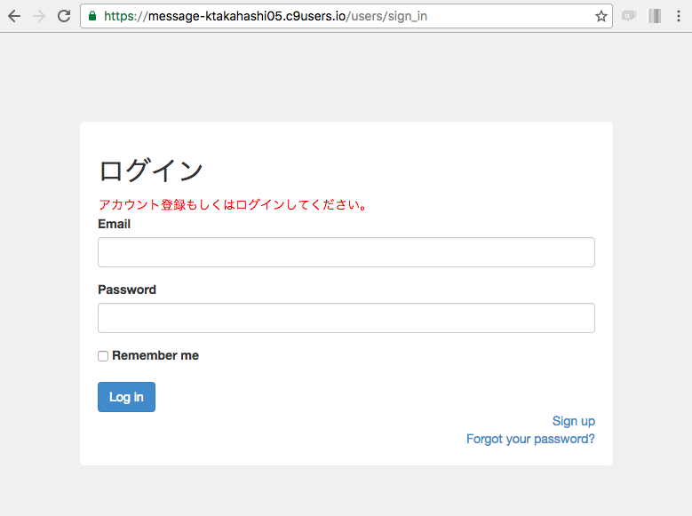

## ログイン画面

### ホーム画面追加とログインリダイレクト設定
`rails g controller`コマンドで`timelines`コントローラおよび`index`アクションを作成する。
```bash
$ bundle exec rails g controller timelines index
```

`index`アクションをアプリケーションのホーム画面として設定する。
```ruby
# config/routes.rb

Rails.application.routes.draw do

#--********************* 下記を削除 *********************
  get 'timelines/index'
#--******************************************************

#--********************* 下記を追加 *********************
  root to: 'timelines#index'
  # 下記でも可
  # root 'timelines#index'
#--******************************************************

  devise_for :users
  # The priority is based upon order of creation: first created -> highest priority.
  # See how all your routes lay out with "rake routes".

#--************************ 省略 ************************

end
```

<br>
未ログインの状態でホーム画面にアクセスした場合に、ログイン画面にリダイレクトするように設定する。<br>

```ruby
# app/controllers/application_controller.rb

class ApplicationController < ActionController::Base
  # Prevent CSRF attacks by raising an exception.
  # For APIs, you may want to use :null_session instead.
  protect_from_forgery with: :exception

  #--********************* 下記を追加 *********************
  before_action :authenticate_user!
  #--******************************************************

  # deviseのコントローラを実行する時は「configure_permitted_parameters」メソッドを実行する
  before_action :configure_permitted_parameters, if: :devise_controller?

  private
  def configure_permitted_parameters
    # 新規作成する場合にname、thumbnail、agreementパラメータを含める
    devise_parameter_sanitizer.permit(:sign_up, keys: [:name, :thumbnail, :agreement])
  end

end
```

<br>
### ログイン画面の作成
`bootstrap:install`コマンドでBootstrapを有効にする。<br>
顧客管理システムでは、BootstrapのサイトからCDNをコピーして、application.html.erbに貼り付けましたが、今回はGemを使用する。
```bash
$ bundle exec rails g bootstrap:install static
```

ログイン画面のデザインを変更する。<br>
主にBootstrapのclassを適用している。<br>
`<% if devise_mapping.rememberable? -%>`で使用している`<% -%>`(閉じタグに`-`が付いている)は、閉じタグの後で改行を行った場合でも出力される時は改行が取り除かれる。<br>
`present?`メソッドは、nil, "", " "(半角スペースのみ), [](空の配列), {}(空のハッシュ) のときに`false`を返す。(何か値が入っている時は`true`となる)

```html
# app/views/devise/sessions/new.html.erb

<div class="wrapper">
  <h2>ログイン</h2>

  <!-- エラーメッセージ表示部 -->
  <% if alert.present? %>
      <p class="alert"><%= alert %></p>
  <% end %>

  <%= form_for(resource, as: resource_name, url: session_path(resource_name)) do |f| %>
      <div class="form-group">
        <%= f.label :email %><br/>
        <%= f.email_field :email, autofocus: true, class: 'form-control' %>
      </div>

      <div class="form-group">
        <%= f.label :password %><br/>
        <%= f.password_field :password, autocomplete: "off", class: 'form-control' %>
      </div>

      <% if devise_mapping.rememberable? -%>
          <div class="form-group">
            <%= f.check_box :remember_me %>
            <%= f.label :remember_me %>
          </div>
      <% end -%>

      <div class="actions">
        <%= f.submit "Log in", class: 'btn btn-primary' %>
      </div>

  <% end %>

  <div class="links">
    <%= render "devise/shared/links" %>
  </div>

</div>
```

scssファイルを作成しデザインを適用。<br>
scssファイル作成前後でデザインを確認<br>
```css
# app/assets/stylesheets/common.scss (新規作成)

body {
  background-color: #f0f0f0;

  div.wrapper {
    background-color: white;
    padding: 20px;
    border-radius: 5px;
  }
}
```
```css
# app/assets/stylesheets/user.scss (新規作成)

div.wrapper {
  width: 600px;
  margin: 0 auto;
  margin-top: 100px;
  p.alert {
    color: red;
    margin: 0;
    padding: 0;
  }
  div.links {
    text-align: right;
  }
}
```
<br>
【scss作成前】

<br>
【scss作成後】


<br>
ログイン成功メッセージを共通レイアウトに表示させる。
```html
# app/views/layouts/application.html.erb

<!DOCTYPE html>
<html>
<head>
  <title>ElitesMessengerRepo</title>
  <%= stylesheet_link_tag    'application', media: 'all', 'data-turbolinks-track' => true %>
  <%= javascript_include_tag 'application', 'data-turbolinks-track' => true %>
  <%= csrf_meta_tags %>
</head>
<body>

<!--***************** 下記を追加 ****************-->
<p class="notice"><%= notice %></p>
<!--*********************************************-->

<%= yield %>

</body>
</html>

```

<br>
### Deviseメッセージの日本語化
I18nモジュールを設定する。<br>
システムのデフォルト言語を日本語にする。<br>
`config.i18n.default_locale`はコメントアウトされているため、先頭の`#`は外す。
```ruby
# config/application.rb

require File.expand_path('../boot', __FILE__)

require 'rails/all'

# Require the gems listed in Gemfile, including any gems
# you've limited to :test, :development, or :production.
Bundler.require(*Rails.groups)

module ElitesMessengerRepo
  class Application < Rails::Application
    # Settings in config/environments/* take precedence over those specified here.
    # Application configuration should go into files in config/initializers
    # -- all .rb files in that directory are automatically loaded.

    # Set Time.zone default to the specified zone and make Active Record auto-convert to this zone.
    # Run "rake -D time" for a list of tasks for finding time zone names. Default is UTC.
    # config.time_zone = 'Central Time (US & Canada)'

    # The default locale is :en and all translations from config/locales/*.rb,yml are auto loaded.
    # config.i18n.load_path += Dir[Rails.root.join('my', 'locales', '*.{rb,yml}').to_s]

    # --******************** default_localeを:jaに設定する **********************
    config.i18n.default_locale = :ja

    # Do not swallow errors in after_commit/after_rollback callbacks.
    config.active_record.raise_in_transactional_callbacks = true
    
    config.autoload_paths += Dir[Rails.root.join('app', 'uploaders')]
  end
end
```

日本語化ファイル(ja.yml)とDevise用の日本語化ファイル(devise.ja.yml)を`config/locales`ディレクトリ下に設置する
- <a href="https://raw.githubusercontent.com/svenfuchs/rails-i18n/master/rails/locale/ja.yml" target="_blank">ja.yml</a>
- <a href ="https://gist.githubusercontent.com/kaorumori/7276cec9c2d15940a3d93c6fcfab19f3/raw/a8c4f854988391dd345f04ff100441884c324f2a/devise.ja.yml" target="_blank">devise.ja.yml</a>
<br>

顧客管理システムで解説した`wget`コマンドを使用してもOK

<br>
### 動作確認
- `https://【workspace名】-【cloud9のUsername】`にアクセスし、ログイン画面にリダイレクトすること
- メールアドレスとパスワードを入力し、ログイン画面エラーメッセージが表示されること

<br>
下記が表示されていればOK


<br>
### 補足: サーバの起動
- Cloud9上でサーバを起動する場合は`bundle exec rails s -b $IP -p $PORT`
- ソースファイルを変更したら必ずサーバを再起動すること

<br>
### 補足: SCSS
- SCSSはCSSを記入しやすく&読みやすくしたCSSのメタ言語
- CSSと比べて、子要素に対するセレクタを入れ子で表現できる、変数を使用できるなどのメリットがある

<br>
### 補足: Deviseのauthenticatable
- 認証に使用するメソッド名は「authenticate_」+「Deviseに使用するクラス名」になる。
「User」であれば`authenticate_user`、「Admin」であれば`authenticate_admin`。

<br>
### 補足: I18n
- `config/locales`に配置したja.ymlファイルは`I18n.t`で参照する。
- `I18n.t`には`%{}`で囲ってパラメータを渡すことが可能。

```yml
# config/locales/ja.yml

ja:
  test: 'テスト'
  show_param: '%{param}です。'

```

```
# ビューで参照する場合

<%= I18n.t('test') %>
  => 「テスト」
<%= I18n.t('show_param', param: 'テスト') %>
  => 「テストです。」
```
