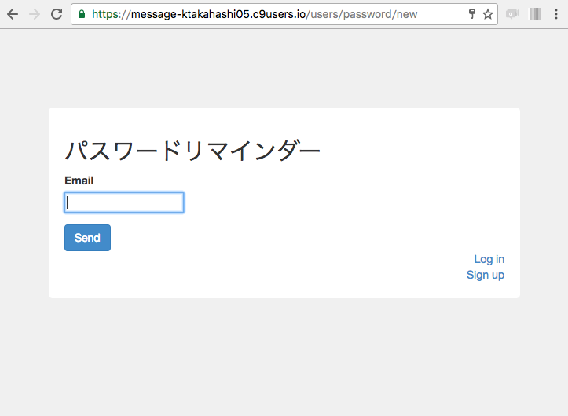
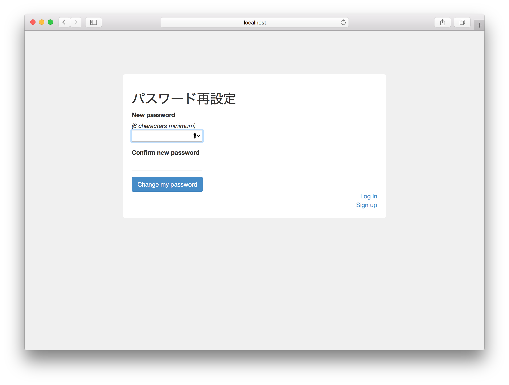

## パスワードリマインダー画面の作成

パスワードリマインダー画面のデザインを変更します。<br>
また、パスワードリマインダー画面では、メール送信が行われますので、 Cloud9 を使用する場合には、前もって [letter_opner_webの導入](https://github.com/elites-team/elites-devise-auth/blob/master/resume/02_%E5%BF%9C%E7%94%A8%E8%AA%B2%E9%A1%8C2.md#22-開発環境でメールの送信を確認するには) をしておいてください。<br>
主にBootstrapのclassを適用しています。
```html
# app/views/devise/passwords/new.html.erb

<div class="wrapper">

  <h2>パスワードリマインダー</h2>

  <%= form_for(resource, as: resource_name, url: password_path(resource_name), html: {method: :post}) do |f| %>
    <%= devise_error_messages! %>

    <div class="form-group">
      <%= f.label :email %><br/>
      <%= f.email_field :email, autofocus: true %>
    </div>

    <div class="actions">
      <%= f.submit "Send", class: 'btn btn-primary' %>
    </div>
  <% end %>

  <div class="links">
    <%= render "devise/shared/links" %>
  </div>
</div>
```

<br>
デザイン変更後のパスワードリマインダー画面<br>
ログインしている場合はログアウトしてから下記にアクセスして、表示内容を確認します。<br>
`https://【workspace名】-【cloud9のUsername】/users/password/new`


<br>
パスワード再設定画面のデザインを変更します。<br>
主にBootstrapのclassを適用しています。
```html
# app/views/devise/passwords/edit.html.erb

<div class="wrapper">

  <h2>パスワード再設定</h2>

  <%= form_for(resource, as: resource_name, url: password_path(resource_name), html: {method: :put}) do |f| %>
      <%= devise_error_messages! %>
      <%= f.hidden_field :reset_password_token %>

      <div class="form-group">
        <%= f.label :password, "New password" %><br/>
        <% if @minimum_password_length %>
            <em>(<%= @minimum_password_length %> characters minimum)</em><br/>
        <% end %>
        <%= f.password_field :password, autofocus: true, autocomplete: "off" %>
      </div>

      <div class="form-group">
        <%= f.label :password_confirmation, "Confirm new password" %><br/>
        <%= f.password_field :password_confirmation, autocomplete: "off" %>
      </div>

      <div class="actions">
        <%= f.submit "Change my password", class: 'btn btn-primary' %>
      </div>
  <% end %>

  <div class="links">
    <%= render "devise/shared/links" %>
  </div>
</div>
```
<br>
デザイン変更後の新パスワード入力画面


<br>
### 動作確認
`https://【workspace名】-【cloud9のUsername】/users/password/new`からリマインダー画面を表示できること。<br>
ログインしている場合はログアウトしてから上記のURLにアクセスすること。<br>
リマインダー画面のメールアドレス送信でメールが受信できること。<br>
メールのリンクからパスワード再設定画面が表示でき、パスワードの再設定ができること。
