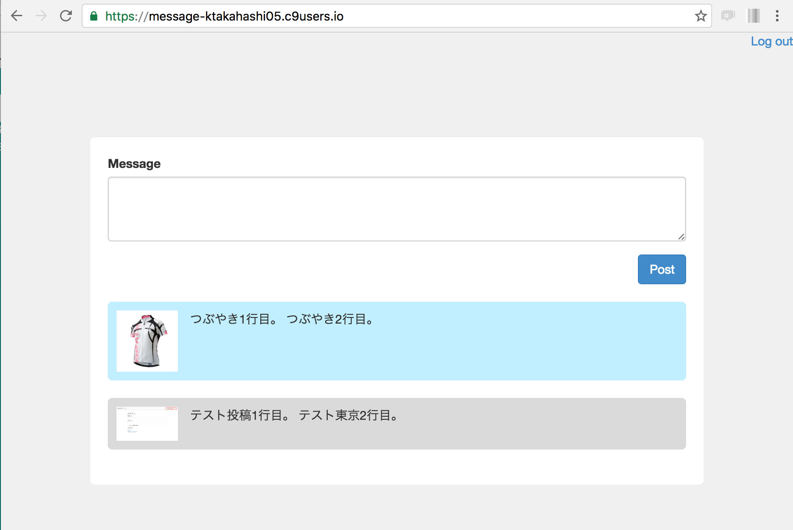

## メッセージの投稿

### タイムラインの入力フィールドを作成

Timelineコントローラのindexアクションで`form_for`のための空オブジェクトを作成します。

```ruby
# app/controllers/timelines_controller.rb

class TimelinesController < ApplicationController
  def index
    # メッセージ入力
    #--******************** 下記を追加 *******************
    @input_message = Timeline.new
    #--***************************************************
  end
end
```

タイムライン画面に入力フィールドを追加します。<br>
`text_area`の`rows`オプションを指定すれば初期表示時の行数を指定することが可能です。

```html
# app/views/timelines/index.html.erb

<div class="wrapper timeline_wrapper">

  <!-- メッセージ入力 -->
  <div class="input">
    <%= form_for @input_message do |f| %>
      <div class="form-group">
        <%= f.label :message %><br/>
        <%= f.text_area :message, class: 'form-control', rows: 3 %>
      </div>
      <div class="actions clearfix">
        <div class="post">
          <%= f.submit 'Post', class: 'btn btn-primary' %>
        </div>
      </div>
    <% end %>
  </div>
</div>
```

<br>
scssファイルを作成しデザインを適用します。
```css
# app/assets/stylesheets/timelines.scss

div.logout_wrapper {
  text-align: right;
}
/* ***************** 下記を追加 ************** */
div.timeline_wrapper {
  &.wrapper {
    width: 700px;
  }
  div.actions {
    div.post {
      float: right;
    }
  }
}
/* ******************************************** */
```

`resources`によりTimelineのCURDルーティングを作成します。
```ruby
# config/routes.rb

Rails.application.routes.draw do
  root to: 'timelines#index'
  devise_for :users
  #--********************** 下記を追加 *******************
  resources :timelines
  #--*****************************************************

  # The priority is based upon order of creation: first created -> highest priority.
  # See how all your routes lay out with "rake routes".

#--************************** 省略 ************************

```

<br>
### メッセージの投稿

タイムラインの取得処理と`create`メソッドでメッセージ投稿処理を追加します。<br>
バリデーションチェックでエラーが発生した場合、flashメッセージにエラー内容を設定します。<br>
モデルオブジェクトの`attributes`属性にカラム名と値をハッシュ(ストロングパラメータを経由するとハッシュとなる)で渡すことで、モデルオブジェクトに一気に値を設定することが可能です。<br>
ストロングパラメータを取得するメソッド名は`input_message_param`となっているが、`timeline_params`でも良いです。<br>
分かりやすい名前を付けます。

```ruby
# app/controllers/timelines_controller.rb

class TimelinesController < ApplicationController
  def index
    # メッセージ入力
    @input_message = Timeline.new
#--************************** 下記を追加 *********************
    # タイムラインを取得
    @timeline = Timeline.includes(:user).order('updated_at DESC')
#--***********************************************************
  end

#--************************** 下記を追加 *********************
  def create
    timeline = Timeline.new
    timeline.attributes = input_message_param
    timeline.user_id = current_user.id
    if timeline.valid? # バリデーションチェック
      timeline.save!
    else
      flash[:alert] = timeline.errors.full_messages
    end
    redirect_to action: :index
  end

  private
  def input_message_param
    params.require(:timeline).permit(:message)
  end
#--***********************************************************

end
```

Timelineに以下のバリデーションを設定する。
- message(投稿内容)は入力必須かつ空文字はNG

```ruby
# app/models/timeline.rb

class Timeline < ActiveRecord::Base
  belongs_to :user

#--*********************** 下記を追加 *************************
  validates :message, presence: true, allow_blank: false
#--************************************************************
end
```

<br>
タイムライン画面を編集します。
- 投稿内容一覧の表示部を追加。
- 投稿内容は「サムネイル」+「メッセージ」で表示。
- バリデーションエラーメッセージを表示するフィールドを追加。

```html
# app/views/timelines/index.html.erb

<div class="wrapper timeline_wrapper">

  <!-- メッセージ入力 -->
  <div class="input">
    <%= form_for @input_message do |f| %>
      <div class="form-group">
        <%= f.label :message %><br/>
        <%= f.text_area :message, class: 'form-control', row: 3 %>
      </div>
      <div class="actions clearfix">
<!--*********************** 下記を追加 ************************-->
        <div class="alert">
          <p class="alert"><%= alert %></p>
        </div>
<!--***********************************************************-->
        <div class="post">
          <%= f.submit 'Post', class: 'btn btn-primary' %>
        </div>
      </div>
    <% end %>
  </div>
<!--*********************** 下記を追加 ************************-->
  <!-- タイムライン -->
  <div class="timeline">
    <% @timeline.each do |t| %>
      <div class="per">
        <p class="icon">
          <% if t.user.thumbnail? %>
              <%= image_tag t.user.thumbnail.url %>
          <% else %>
              NO IMAGE
          <% end %>
        </p>
        <p class="message">
          <%= t.message %>
        </p>
      </div>
    <% end %>
  </div>
<!--***********************************************************-->

</div>
```

<br>
エラーメッセージを投稿ボタンの左に設置します。

```css
# app/assets/stylesheets/timeline.scss

div.logout_wrapper {
  text-align: right;
}

div.timeline_wrapper {
  &.wrapper {
    width: 700px;
  }
  div.actions {
/* ***************** 下記を追加 ************** */
    div.alert {
      float: left;
    }
/* ******************************************** */
    div.post {
      float: right;
    }
  }
}
```

<br>
サーバを起動して確認します。<br>
下記のように表示されていることを確認します。<br>


<br>
### タイムラインのデザインの変更
タイムライン画面を編集します。
- メッセージに枠をつける
- 自分が投稿したメッセージの背景は水色(#C1EFFF)、自分以外は灰色(#DADADA)にする。

`<%= 'mine' if t.user.id == current_user.id %>"`はif修飾子といい、`式 if 式`で記述します。<br>
右辺の条件が成立する時に、左辺の式を評価してその結果を返します。<br>
条件が成立しなければ nil を返します。<br>
コメントしたユーザーIDとログインしているユーザーIDが一致いた場合、`mine`を返します。(`class`に`mine`が追加される)

```html
# app/views/timelines/index.html.erb

<div class="wrapper timeline_wrapper">

  <!-- メッセージ入力 -->
  <div class="input">
    <%= form_for @input_message do |f| %>
      <div class="form-group">
        <%= f.label :message %><br/>
        <%= f.text_area :message, class: 'form-control', row: 3 %>
      </div>
      <div class="actions clearfix">
        <div class="alert">
          <p class="alert"><%= alert %></p>
        </div>
        <div class="post">
          <%= f.submit 'Post', class: 'btn btn-primary' %>
        </div>
      </div>
    <% end %>
  </div>

  <!-- タイムライン -->
  <div class="timeline">
    <% @timeline.each do |t| %>
<!--****** <div class="per">を下記に変更 ********-->
      <div class="per <%= 'mine' if t.user.id == current_user.id %>">
<!--*********************************************-->
        <p class="icon">
          <% if t.user.thumbnail? %>
              <%= image_tag t.user.thumbnail.url %>
          <% else %>
              NO IMAGE
          <% end %>
        </p>
        <p class="message">
          <%= t.message %>
        </p>
      </div>
    <% end %>
  </div>

</div>
```

```css
# app/assets/stylesheets/timeline.scss

div.logout_wrapper {
  text-align: right;
}

div.timeline_wrapper {
  &.wrapper {
    width: 700px;
  }
  div.actions {
    div.alert {
      float: left;
    }
    div.post {
      float: right;
    }
  }

/* ***************** 下記を追加 ************** */
  div.timeline {
    div.per {
      border-radius: 5px;
      padding: 10px;
      margin-bottom: 20px;

      background-color: #DADADA;
      &.mine {
        background-color: #C1EFFF;
      }

      p {
        margin: 0;
      }
      p.icon {
        display: inline-block;
        width: 70px;
        vertical-align: top;
        img {
          max-width: 100%;
          height: auto;
        }
      }
      p.message {
        display: inline-block;
        margin-left: 10px;
        width: 500px;
        vertical-align: top;
      }
    }
  }
/* ******************************************** */
}
```
サーバを起動して確認します。<br>
下記のように表示されていることを確認します。<br>


<br>
### メッセージの改行
今の状態だと、投稿後に表示されるメッセージが改行されません。<br>
simple_formatメソッドを使用して、テキストエリアの`\n`改行を`<br/>`に変換します。

```html
# app/views/timelines/index.html.erb

<div class="wrapper timeline_wrapper">

  <!-- メッセージ入力 -->
  <div class="input">
    <%= form_for @input_message do |f| %>
      <div class="form-group">
        <%= f.label :message %><br/>
        <%= f.text_area :message, class: 'form-control', row: 3 %>
      </div>
      <div class="actions clearfix">
        <div class="alert">
          <p class="alert"><%= alert %></p>
        </div>
        <div class="post">
          <%= f.submit 'Post', class: 'btn btn-primary' %>
        </div>
      </div>
    <% end %>
  </div>

  <!-- タイムライン -->
  <div class="timeline">
    <% @timeline.each do |t| %>
      <div class="per <%= 'mine' if t.user.id == current_user.id %>">
        <p class="icon">
          <% if t.user.thumbnail? %>
              <%= image_tag t.user.thumbnail.url %>
          <% else %>
              NO IMAGE
          <% end %>
        </p>
<!--**************************** 修正前 ***************************-->
        <p class="message">
          <%= t.message %>
        </p>
<!--**************************** 修正後 ***************************-->
        <%= simple_format t.message, class: 'message' %>
        
      </div>
    <% end %>
  </div>

</div>
```

### 動作確認
- タイムライン画面でメッセージの投稿ができること。
- 別ユーザでログインし、投稿内容のデザインの確認をする。

### 補足: simple_format
- `simple_format`はテキスト文字をHTMLに加工し、変換後のHTMLは自動でpタグで括られます。
- 括られるpタグにデザインを設定したい場合は`class: 'クラス名'`を`simple_format`に引数として渡します。
