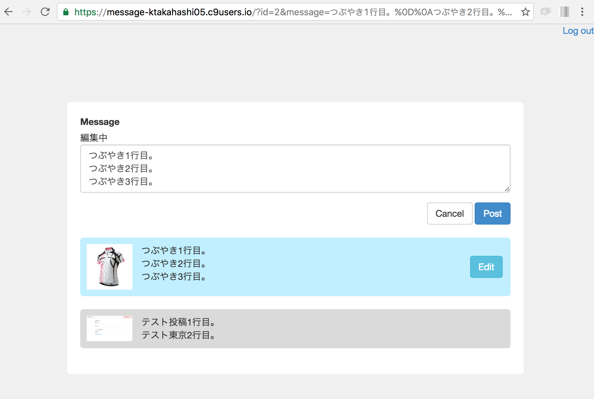

## メッセージの編集

`update`アクションでメッセージ編集処理を作成します。<br>
`index`アクションで`params[:id]`が渡されてきた場合、該当するメッセージを取得します。

```ruby
# app/controllers/timelines_controller.rb

class TimelinesController < ApplicationController
  def index
    
#--************* 修正前 *************
    @input_message = Timeline.new
#--************* 修正後 *************
    # メッセージ入力
    @input_message = params[:id] ? Timeline.find(params[:id]) : Timeline.new
#--**********************************

    # タイムラインを取得
    @timeline = Timeline.includes(:user).order('updated_at DESC')
  end

  def create
    timeline = Timeline.new
    timeline.attributes = input_message_param
    timeline.user_id = current_user.id
    if timeline.valid? # バリデーションチェック
      timeline.save!
    else
      flash[:alert] = timeline.errors.full_messages
    end
    redirect_to action: :index
  end

#-*********************** 下記を追加 **************************
  def update
    timeline = Timeline.find(params[:id])
    timeline.attributes = input_message_param
    if timeline.valid? # バリデーションチェック
      timeline.save!
    else
      flash[:alert] = timeline.errors.full_messages
    end
    redirect_to action: :index
  end
#-*************************************************************

  private
  def input_message_param
    params.require(:timeline).permit(:message)
  end

end
```

<br>
Railsでは自前の独自ヘルパー(Helper)メソッドの作成することが可能です。<br>
投稿内容が自分の投稿か判定する`mypost?`ヘルパーメソッドを作成します。
```ruby
# app/helpers/timelines_helper.rb

module TimelinesHelper

  # 自分の投稿か判定する
  def mypost?(timeline)
    timeline.user.id == current_user.id
  end

end
```

<br>
タイムライン画面を編集します。
- 自分の投稿の場合は編集ボタンを追加。
- 編集中はテキストエリア上部に「編集中」を表示。
- 編集中は編集をキャンセルするボタンを表示。
`persisted?`は登録済みかどうかチェックしてくれるメソッドです。<br>
`true`の場合は登録済み<br>
`false`の場合は未登録(これから登録しようとしているデータ)

```html
# app/views/timelines/index.html.erb

<div class="wrapper timeline_wrapper">

  <!-- メッセージ入力 -->
  <div class="input">
    <%= form_for @input_message do |f| %>
      <div class="form-group">
        <%= f.label :message %>
<!--***************** 下記を追加 *****************-->
        <!--** 編集中の場合は場合はメッセージを表示 **-->
        <% if @input_message.persisted? %>
          編集中
        <% end %>
        <br/>
<!--**********************************************-->
        <%= f.text_area :message, class: 'form-control', row: 3 %>
      </div>
      <div class="actions clearfix">
        <div class="alert">
          <p class="alert"><%= alert %></p>
        </div>
        <div class="post">
<!--***************** 下記を追加 *****************-->
          <!--** 編集中は編集をキャンセルするボタンを表示 **-->
          <% if @input_message.persisted? %>
            <%= link_to root_path do %>
              <%= button_tag 'Cancel', class: 'btn btn-default' %>
            <% end %>
          <% end %>
<!--**********************************************-->
          <%= f.submit 'Post', class: 'btn btn-primary' %>
        </div>
      </div>
    <% end %>
  </div>

  <!-- タイムライン -->
  <div class="timeline">
    <% @timeline.each do |t| %>
      <div class="per <%= 'mine' if mypost?(t) %>">
        <p class="icon">
          <% if t.user.thumbnail? %>
              <%= image_tag t.user.thumbnail.url %>
          <% else %>
              NO IMAGE
          <% end %>
        </p>
        <%= simple_format t.message, class: 'message' %>
<!--***************** 下記を追加 *****************-->
        <!--** 自作したヘルパーメソッドを呼ぶ ******-->
        <!--** 自分の投稿の場合は編集ボタンを追加 **-->
        <% if mypost?(t) %>
          <%= link_to root_path(id: t.id, message: t.message) do %>
            <%= button_tag 'Edit', class: 'btn btn-info' %>
          <% end %>
        <% end %>
<!--**********************************************-->
      </div>
    <% end %>
  </div>

</div>
```

<br>
### 動作確認
- 編集ボタンから自分の投稿を変更できることを確認。<br>


