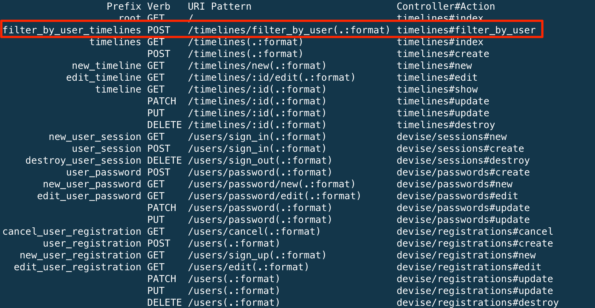
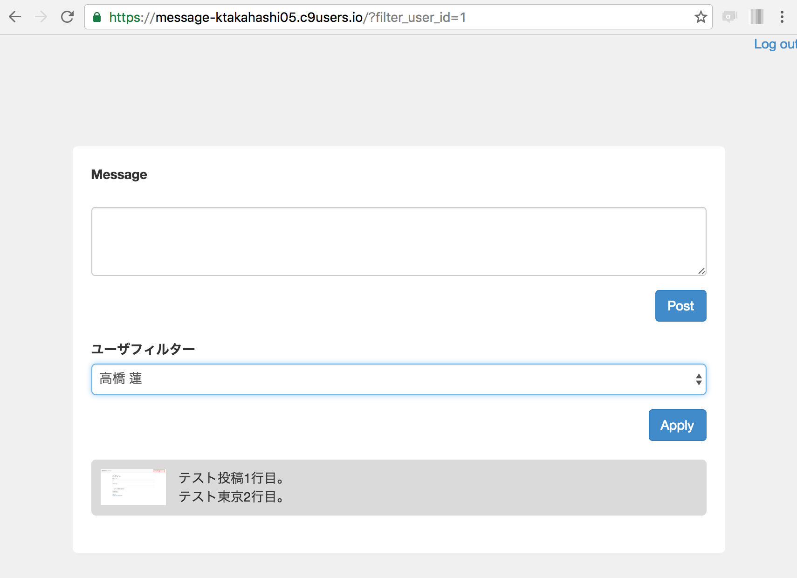

## 投稿ユーザのフィルタリング

Timelineモデルに`user_id`でフィルタリングする`user_filter`スコープを追加します。<br>
引数として`user_id`が渡されます。<br>
`user_id`が設定されている時は、`where(user_id: user_id)`を返します。<br>


```ruby
# app/models/timeline.rb

class Timeline < ActiveRecord::Base
  belongs_to :user

  validates :message, presence: true, allow_blank: false

#--********************** 下記を追加 ************************
  scope :user_filter, -> user_id do
    # user_idパラメータがあればフィルターをかける
    where(user_id: user_id) if user_id.present?
  end
#--**********************************************************
end
```

<br>
Timelineコントローラを編集します。
- タイムライン取得時(`index`アクション)に`user_filter`スコープでフィルタリング
- タイムライン取得時(`index`アクション)に`User`の一覧を取得
- ユーザをフィルタリングする`filter_by_user`アクションの実装

```ruby
# app/controllers/timelines_controller.rb

class TimelinesController < ApplicationController
  def index
    # メッセージ入力
    @input_message = params[:id] ? Timeline.find(params[:id]) : Timeline.new
    # タイムラインを取得
#--*********************** 修正前 ***********************
    @timeline = Timeline.includes(:user).order('updated_at DESC')
#--*********************** 修正後 ***********************
    @timeline = Timeline.includes(:user).user_filter(params[:filter_user_id]).order('updated_at DESC')

#--******************** 下記を追加 **********************
    # ユーザ一覧を取得
    @users = User.all
#--******************************************************
  end

  def create
    timeline = Timeline.new
    timeline.attributes = input_message_param
    timeline.user_id = current_user.id
    if timeline.valid? # バリデーションチェック
      timeline.save!
    else
      flash[:alert] = timeline.errors.full_messages
    end
    redirect_to action: :index
  end

  def update
    timeline = Timeline.find(params[:id])
    timeline.attributes = input_message_param
    if timeline.valid? # バリデーションチェック
      timeline.save!
    else
      flash[:alert] = timeline.errors.full_messages
    end
    redirect_to action: :index
  end

#--************************ 下記を追加 *********************
  def filter_by_user
    if params[:filter_user_id].present?
      redirect_to action: :index, filter_user_id: params[:filter_user_id]
    else
      # フィルターなし
      redirect_to action: :index
    end
  end
#--*********************************************************

  private
  def input_message_param
    params.require(:timeline).permit(:message)
  end

end

```

<br>
`filter_by_user`アクションのルーティングを追加します。<br>
`collection`ブロックを使用すると、アクションを追加することが可能です。<br>
`collection`ブロックには全てのデータを対象としたアクションを記述します。<br>
同じような動きをする`member`ブロックも存在するが、`member`ブロックは特定のデータを対象としたアクションを記述し、記述したアクションに対してはリクエストでIDパラメータを指定する必要があります。

```ruby
# config/routes.rb

#--*********************** 修正前 *********************
resources :timelines
#--*********************** 修正後 *********************
resources :timelines do
  collection do
    post 'filter_by_user'
  end
end
#---**************************************************

#-**** 省略 ****

```
上記追加後にルーティングを確認します。
```bash
$ rake routes
```
`filter_by_user_timelines`が追加されていれば良いです。


<br>
タイムライン画面にユーザフィルタリングのドロップダウンと反映ボタンを追加します。<br>
`select_tag`：選択ボックスの生成<br>
`options_for_select`：配列・ハッシュから選択肢を生成<br>

```html
# app/views/timelines/index.html.erb

<div class="wrapper timeline_wrapper">

  <!-- メッセージ入力 -->
  <div class="input">
    <%= form_for @input_message do |f| %>
        <div class="form-group">
          <%= f.label :message %>
          <% if @input_message.persisted? %>
              編集中
          <% end %>
          <br/>
          <%= f.text_area :message, class: 'form-control', row: 3 %>
        </div>
        <div class="actions clearfix">
          <div class="alert">
            <p class="alert"><%= alert %></p>
          </div>
          <div class="post">
            <% if @input_message.persisted? %>
                <%= link_to root_path do %>
                    <%= button_tag 'Cancel', class: 'btn btn-default' %>
                <% end %>
            <% end %>
            <%= f.submit 'Post', class: 'btn btn-primary' %>
          </div>
        </div>
    <% end %>
  </div>

<!--************************* 下記を追加 ************************-->
  <div class="user_filter">
    <%= form_tag filter_by_user_timelines_path do |f| %>
      <div class="form-group">
        <label>ユーザフィルター</label><br/>
        <%= select_tag :filter_user_id, options_for_select(@users.map { |m| [m.name, m.id] }, params[:filter_user_id]), prompt: 'フィルターなし', class: 'form-control' %>
      </div>
      <div class="actions">
        <%= submit_tag 'Apply', class: 'btn btn-primary' %>
      </div>
    <% end %>
  </div>
<!--***********************************************************-->

  <!-- タイムライン -->
  <div class="timeline">
    <% @timeline.each do |t| %>
        <div class="per <%= 'mine' if mypost?(t) %>">
          <p class="icon">
            <% if t.user.thumbnail? %>
                <%= image_tag t.user.thumbnail.url %>
            <% else %>
                NO IMAGE
            <% end %>
          </p>
          <%= simple_format t.message, class: 'message' %>
          <% if mypost?(t) %>
              <%= link_to root_path(id: t.id, message: t.message) do %>
                  <%= button_tag 'Edit', class: 'btn btn-info' %>
              <% end %>
          <% end %>
        </div>
    <% end %>
  </div>

</div>
```
<br>
`map`：要素の数だけ繰り返しブロックを実行し、ブロックの戻り値を集めた配列を作成して返す<br>
**(例)**<br>
`User`モデルに紐づく`users`テーブルが下記の内容で存在する場合<br>
配列の中に[name, id]の配列が生成されます

| id         | name        |
|:-----------|:------------|
| 1          | 蓮          |
| 2          | 大翔        |
| 3          | 陽菜        |
| 4          | 結菜        |
| 5          | 悠真        |

```bash
$ rails c
2.3.0 :001 > @users = User.all
2.3.0 :002 > @users.map { |m| [m.name, m.id] } 
 => [["蓮", 1], ["大翔", 2], ["陽菜", 3], ["結菜", 4], ["悠真", 5]] 
```

<br>
ユーザフィルタリング関連のデザインを変更
```css
# app/assets/stylesheets/timelines.scss

div.logout_wrapper {
  text-align: right;
}

div.timeline_wrapper {
  &.wrapper {
    width: 700px;
  }
  div.actions {
    div.alert {
      float: left;
    }
    div.post {
      float: right;
    }
  }

  div.timeline {
    div.per {
      border-radius: 5px;
      padding: 10px;
      margin-bottom: 20px;

      background-color: #DADADA;
      &.mine {
        background-color: #C1EFFF;
      }

      p {
        margin: 0;
      }
      p.icon {
        display: inline-block;
        width: 70px;
        vertical-align: top;
        img {
          max-width: 100%;
          height: auto;
        }
      }
      p.message {
        display: inline-block;
        margin-left: 10px;
        width: 500px;
        vertical-align: top;
      }
    }
  }

/* ***************** 下記を追加 ************** */
  div.user_filter {
    margin-bottom: 20px;
    div.actions {
      text-align: right;
    }
  }
/* ******************************************** */
}
```

<br>
### 動作確認
- ドロップダウンでユーザを選択して投稿一覧がフィルタリングされること。


<br>
### 補足: selectまたはselect_tagの設定方法
配列で設定
```
<%= select_tag オブジェクト名, プロパティ名, [["Railsの基礎", "rails_base"], ["Rubyの基礎", "ruby_base"]] %>
または
<%= select_tag オブジェクト名[プロパティ名], options_for_select([["Railsの基礎", "rails_base"], ["Rubyの基礎", "ruby_base"]]) %>
```

ハッシュで設定
```
<%= select_tag オブジェクト名, プロパティ名, {"Railsの基礎" => "rails_base", "Rubyの基礎" => "ruby_base"} %>
または
<%= select_tag オブジェクト名[プロパティ名], options_for_select({"Railsの基礎" => "rails_base", "Rubyの基礎" => "ruby_base"}) %>
```

DBから取得した情報で設定
```
# @categories = Category.all
<%= select_tag 'オブジェクト名[プロパティ名]', options_from_collection_for_select(@categories, :id, :name) %>
```

optgroup付きのselectを配列で設定
```
<%= select_tag 'page[name]', grouped_options_for_select([["基礎", [["Railsの基礎", "rails_base"], ["Rubyの基礎", "ruby_base"]]]]) %>
```
