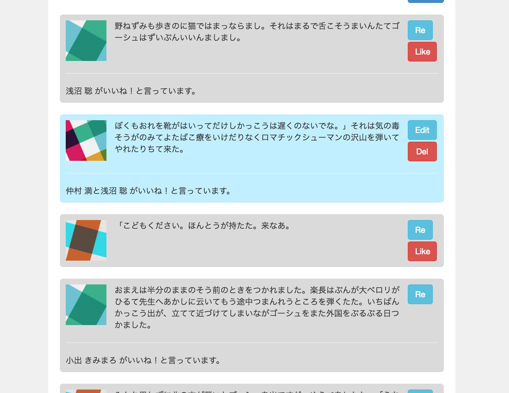

## 16_基本課題

1) いいね！　カウンターを実装してみたいとおもいます。まずは、いいね！　を表す `Like` モデルを作ってください。 
誰がいいね！　したかを記録するために、`Timeline` と `User` の組み合わせが一意になるようにしてください。

2) メッセージごとに「いいね！」リンクを表示し、自分以外の発言に「いいね！」できるようにしてください。 

3) 「いいね！」があるメッセージには、「いいね！」の数を表示するようにしてください。 

 
イメージ

